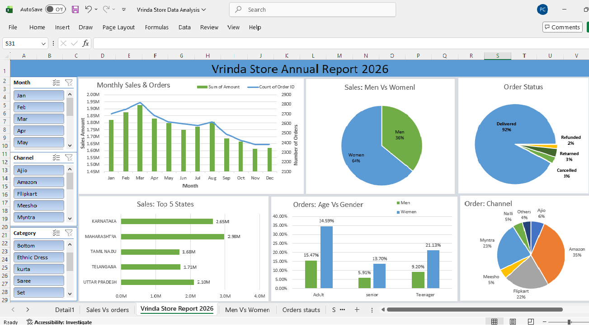

# Vrinda Store Annual Sales Analysis 2026

## 📊 Project Overview

An Excel-based sales and order analysis project created to analyze Vrinda Store's annual sales performance, order trends, customer demographics, sales channels, order status, and top-performing states.

## 🎯 Objective

The objective of this project is to transform raw sales data into an interactive Excel dashboard that helps understand sales performance and identify important business trends.

## 🛠️ Tools & Skills Used

* Microsoft Excel
* Pivot Tables
* Pivot Charts
* Slicers
* Data Analysis
* Data Visualization
* Excel Dashboard
* Sales & Order Analysis

## 📈 Dashboard Analysis

The interactive dashboard provides analysis of:

1. **Monthly Sales & Orders**
2. **Sales by Gender**
3. **Order Status**
4. **Orders by Channel**
5. **Top 5 States by Sales**
6. **Orders by Age Group & Gender**

## 🔍 Key Business Insights

* Women customers contribute a higher share of sales than men.
* Maharashtra and Karnataka are among the top-performing states by sales.
* The majority of orders are delivered successfully.
* Sales and order volume vary across different months.
* The dashboard allows users to analyze performance using Month, Channel, and Category filters.

## 💡 Dashboard Features

* Interactive slicers for filtering the analysis
* Monthly sales and order trend visualization
* Gender-based sales analysis
* Order status analysis
* Channel-wise order analysis
* State-wise sales comparison
* Age group and gender analysis

## 📷 Dashboard Preview

## 📁 Project Files

* `Vrinda_Store_Annual_Sales_Analysis_2026.xlsx` — Complete Excel analysis and interactive dashboard
* `dashboard.png` — Dashboard preview

## 🚀 Skills Demonstrated

This project demonstrates practical skills in:

* Excel data analysis
* Pivot Tables and Pivot Charts
* Interactive dashboard creation
* Business-oriented data visualization
* Sales performance analysis
* Extracting actionable business insights

## 👩‍💻 Author

**Payal Chak**

Aspiring Data Analyst | Excel | SQL | Power BI | Python

